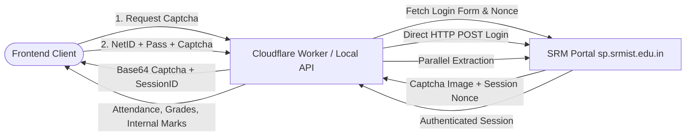

# 🚀 SRM Student Portal Scraper & Cloudflare Worker

[](https://github.com/coderaarav12/srm_student_portal_scraper/actions/workflows/deploy.yml)
[](https://www.typescriptlang.org/)
[](https://workers.cloudflare.com/)

A high-performance, direct-HTTP scraping engine and Cloudflare Worker API for the **SRMIST Student Portal** (`sp.srmist.edu.in`). It extracts live attendance, multi-semester academic grades, SGPA/CGPA history, credit breakdowns, and internal test marks with zero browser overhead.

---

## 📑 Table of Contents

- [Features](#-features)
- [Architecture](#-architecture)
- [Project Structure](#-project-structure)
- [API Reference](#-api-reference)
  - [1. Fetch CAPTCHA Session](#1-fetch-captcha-session)
  - [2. Login & Scrape](#2-login--scrape)
  - [3. Fetch Cached Attendance](#3-fetch-cached-attendance)
  - [4. Fetch Semester Grades & CGPA](#4-fetch-semester-grades--cgpa)
  - [5. Fetch Internal Test Marks](#5-fetch-internal-test-marks)
  - [6. Health Check](#6-health-check)
- [Local Development](#-local-development)
- [Cloudflare Worker Deployment](#-cloudflare-worker-deployment)
  - [Manual Deployment](#manual-deployment)
  - [Automated GitHub Actions CI/CD](#automated-github-actions-cicd)
- [Frontend Integration](#-frontend-integration)
- [Security & Rate Limiting](#-security--rate-limiting)

---

## ✨ Features

- **⚡ Direct HTTP Core**: Zero headless browser latency. Uses optimized TLS requests, cookie jar session management, and DOM parsing with [cheerio](https://cheerio.js.org/).
- **🎯 Full Academic Performance Extraction**:
  - **Live Attendance**: Conducted hours, absent hours, attended hours, and percentage per subject.
  - **All-Semester Grades & CGPA**: Course code, title, credits, letter grade (`O`, `A+`, `A`, `B+`, `B`, `C`, `F`), and calculated SGPA per semester.
  - **Internal Assessment Scores**: Component-wise test scores (CT1, CT2, assignments) mapped to course codes.
- **☁️ Cloudflare Workers & Durable Objects**: Session persistence, distributed caching, and auto-cleanup alarms.
- **🔄 Session Expiration Awareness**: Structured `401 Unauthorized` responses with `{ sessionExpired: true }` for smooth client-side re-authentication.
- **💻 Standalone Local Server**: Built-in lightweight HTTP daemon for local development and offline environments.

---

## 🏛️ Architecture



---

## 📁 Project Structure

```
srm_student_portal_scraper/
├── .github/
│   └── workflows/
│       └── deploy.yml          # GitHub Actions CI/CD to Cloudflare
├── srm/
│   ├── cloudflare/             # Cloudflare Worker codebase
│   │   ├── src/
│   │   │   ├── index.ts        # Worker & Durable Object router
│   │   │   └── scraper.ts      # Core Direct HTTP Scraper engine
│   │   ├── wrangler.jsonc      # Cloudflare Worker configuration
│   │   ├── package.json
│   │   └── tsconfig.json
│   ├── src/
│   │   ├── fresh-attendance.ts # Local standalone HTTP server (Port 8787)
│   │   └── main.ts             # CLI test runner
│   ├── package.json
│   └── tsconfig.json
├── .gitignore
└── README.md
```

---

## 📡 API Reference

### 1. Fetch CAPTCHA Session
Fetches a fresh CAPTCHA image and initializes a challenge session.

- **Method**: `GET`
- **Endpoint**: `/captcha` or `/api/captcha`
- **Query Params**: `sessionId` *(optional)*

#### Response (`200 OK`):
```json
{
  "success": true,
  "sessionId": "a1b2c3d4-e5f6-7890-abcd-ef1234567890",
  "captchaImage": "iVBORw0KGgoAAAANSUhEUgAA...",
  "captchaDataUrl": "data:image/png;base64,iVBORw0KGgoAAAANSUhEUgAA..."
}
```

---

### 2. Login & Scrape
Authenticates the user using their NetID, password, and solved CAPTCHA, and immediately scrapes academic data.

- **Method**: `POST`
- **Endpoint**: `/login` or `/api/login`
- **Headers**: `Content-Type: application/json`

#### Request Body:
```json
{
  "netId": "ag0892",
  "password": "your_portal_password",
  "captcha": "3aB8xQ",
  "sessionId": "a1b2c3d4-e5f6-7890-abcd-ef1234567890"
}
```

#### Response (`200 OK`):
```json
{
  "success": true,
  "message": "Login successful",
  "sessionId": "a1b2c3d4-e5f6-7890-abcd-ef1234567890",
  "attendance": [
    {
      "code": "21CSC204J",
      "name": "Design and Analysis of Algorithms",
      "attended": 42,
      "total": 45,
      "percentage": 93.33
    }
  ],
  "marks": {
    "cgpa": 9.45,
    "creditsEarned": 84,
    "creditsRegistered": 84,
    "creditsRequired": 163,
    "semesters": [
      {
        "semester": 1,
        "sgpa": 9.6,
        "courses": [
          {
            "code": "21MTH101T",
            "name": "Calculus and Linear Algebra",
            "credit": 4,
            "grade": "O"
          }
        ]
      }
    ]
  },
  "internalMarks": [
    {
      "code": "21CSC204J",
      "name": "Design and Analysis of Algorithms",
      "rawMarkText": "45/50",
      "markObtained": 45,
      "maxMark": 50
    }
  ]
}
```

#### Error Response (`400 Bad Request`):
```json
{
  "success": false,
  "error": "Invalid captcha code",
  "requiresCaptcha": true,
  "sessionId": "a1b2c3d4-e5f6-7890-abcd-ef1234567890",
  "captchaImage": "iVBORw0KGgoAAAANSUhEUgAA...",
  "captchaDataUrl": "data:image/png;base64,iVBORw0KGgoAAA..."
}
```

---

### 3. Fetch Cached Attendance
Returns the current term's attendance details for an active session.

- **Method**: `GET`
- **Endpoint**: `/attendance?sessionId=<sessionId>`

#### Response (`200 OK`):
```json
{
  "success": true,
  "attendance": [
    {
      "code": "21CSC204J",
      "name": "Design and Analysis of Algorithms",
      "attended": 42,
      "total": 45,
      "percentage": 93.33
    }
  ],
  "cached": true
}
```

---

### 4. Fetch Semester Grades & CGPA
Returns full semester-wise SGPA and course letter grades.

- **Method**: `GET`
- **Endpoint**: `/marks?sessionId=<sessionId>`

#### Response (`200 OK`):
```json
{
  "success": true,
  "marks": {
    "cgpa": 9.45,
    "creditsEarned": 84,
    "creditsRegistered": 84,
    "creditsRequired": 163,
    "semesters": [...]
  },
  "cached": true
}
```

---

### 5. Fetch Internal Test Marks
Returns published internal test and continuous assessment scores.

- **Method**: `GET`
- **Endpoint**: `/internal-marks?sessionId=<sessionId>`

---

### 6. Health Check
- **Method**: `GET`
- **Endpoint**: `/health`

#### Response (`200 OK`):
```json
{
  "ok": true,
  "service": "srm-portal-local-server",
  "version": "2.3.0"
}
```

---

## 💻 Local Development

### Prerequisites
- Node.js 20+
- npm

### 1. Clone & Install Dependencies
```bash
git clone https://github.com/coderaarav12/srm_student_portal_scraper.git
cd srm_student_portal_scraper/srm
npm install
```

### 2. Start the Local API Daemon (Port 8787)
```bash
npx tsx src/fresh-attendance.ts
```

The local API server will be live at:
`http://127.0.0.1:8787`

---

## ☁️ Cloudflare Worker Deployment

### Manual Deployment
```bash
cd srm/cloudflare
npm install
npx wrangler login
npx wrangler deploy
```

### Automated GitHub Actions CI/CD
On every push to the `main` branch, `.github/workflows/deploy.yml` automatically validates and deploys the worker.

To enable automated deployment:
1. Go to your GitHub repository: **Settings > Secrets and variables > Actions**.
2. Add the following repository secrets:
   - `CF_API_TOKEN`: Your Cloudflare API Token (with **Worker:Edit** permissions).
   - `CF_ACCOUNT_ID`: Your Cloudflare Account ID.

---

## 🖥️ Frontend Integration

Configure your frontend application (e.g. Next.js) by pointing `STUDENT_PORTAL_BACKEND_URL` to your Cloudflare Worker URL or local daemon:

```env
# .env.local
STUDENT_PORTAL_BACKEND_URL=https://srm-portal-scraper.your-subdomain.workers.dev
NEXT_PUBLIC_STUDENT_PORTAL_BACKEND_URL=https://srm-portal-scraper.your-subdomain.workers.dev
```

---

## 🔒 Security & Rate Limiting

- **No Stored Plaintext Credentials**: Passwords are used strictly for in-flight session authentication with `sp.srmist.edu.in` and never saved to persistent database disks.
- **Durable Object Isolation**: Each student session is sandboxed in its own Durable Object instance.
- **TTL Cache Expiration**: Inactive session records automatically expire and get purged after 5 minutes (300 seconds).

---

## 📜 License

MIT License © 2026 [coderaarav12](https://github.com/coderaarav12).
